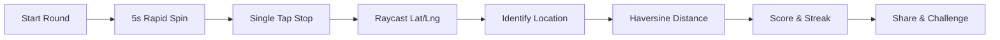
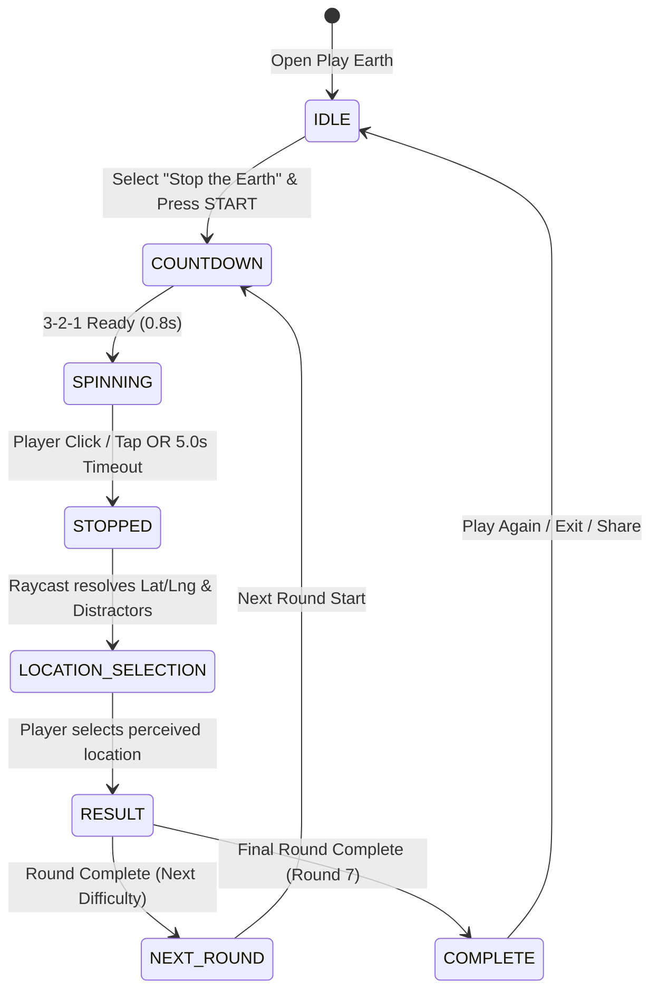
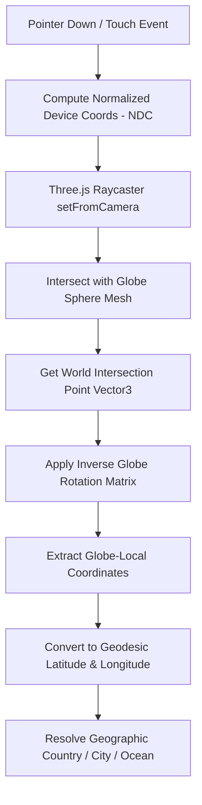

# MooEarth Live — STOP THE EARTH
## Phase S0: Architecture & Discovery Blueprint

```
  ██████╗ ████████╗ ██████╗ ██████╗     ████████╗██╗  ██╗███████╗    ███████╗ █████╗ ██████╗ ████████╗██╗  ██╗
 ██╔════╝ ╚══██╔══╝██╔═══██╗██╔══██╗    ╚══██╔══╝██║  ██║██╔════╝    ██╔════╝██╔══██╗██╔══██╗╚══██╔══╝██║  ██║
 ╚█████╗     ██║   ██║   ██║██████╔╝       ██║   ███████║█████╗      █████╗  ███████║██████╔╝   ██║   ███████║
  ╚═══██╗    ██║   ██║   ██║██╔═══╝        ██║   ██╔══██║██╔══╝      ██╔══╝  ██╔══██║██╔══██╗   ██║   ██╔══██║
 ██████╔╝    ██║   ╚██████╔╝██║            ██║   ██║  ██║███████╗    ███████╗██║  ██║██║  ██║   ██║   ██║  ██║
 ╚═════╝     ╚═╝    ╚═════╝ ╚═╝            ╚═╝   ╚═╝  ╚═╝╚══════╝    ╚══════╝╚═╝  ╚═╝╚═╝  ╚═╝   ╚═╝   ╚═╝  ╚═╝
```

---

## 1. Executive Summary & Core Gameplay Loop

**"Stop the Earth"** is an adrenaline-fueled, skill-based geographic timing and pinpoint game built directly on MooEarth Live's existing 3D WebGL globe.

Unlike traditional multiple-choice trivia quizzes where players merely answer questions from text, **Stop the Earth** challenges the player's spatial reflexes, planetary awareness, and geographic precision:



### The Competitive Differentiator
Rather than simply asking "Which country did you click?", the competitive mechanic calculates the **geodesic distance (in kilometers)** between where the player stopped the globe and verified geographic target landmarks. An **Earthshot (< 10 km)** awards maximum perfection points, while proximity determines precision scoring.

---

## 2. Existing MooEarth Systems Reused

To preserve codebase integrity and prevent duplicate architectures, **Stop the Earth** reuses 15 existing subsystems without creating parallel frameworks:

| Subsystem | Existing Path / Implementation | Reused Capability |
| :--- | :--- | :--- |
| **1. Play Earth Engine** | `src/engines/game/` | Registry, session store, difficulty scaling, anti-repeat engine. |
| **2. Game Overlay HUD** | `src/components/Globe/PlayEarthOverlay.tsx` | Mode selector, phase lifecycle, sound triggers, XP rewards, level ups. |
| **3. 3D WebGL Globe** | `src/components/Globe/GlobeScene.tsx` | Three.js v0.184.0 + `react-globe.gl` v2.38.0 canvas, lighting, atmosphere. |
| **4. Globe Camera & Controls**| `src/hooks/useGlobeControls.ts` | OrbitControls, rotation speed manipulation, pointOfView interpolation. |
| **5. Geodesic Math** | `src/engines/game/ValidationEngine.ts` | Haversine formula (`haversineDistance`), radian conversion, coordinate types. |
| **6. Canonical Country Data**| `src/data/countries/canonicalCountries.ts` | 195 sovereign nations, ISO codes, coordinates, boundary metadata. |
| **7. Places & Cities Data** | `src/data/places/index.ts`, `locations.ts` | Verified city coordinates, population, country mapping. |
| **8. GeoJSON Boundaries** | `public/data/countries-110m.json` | High-performance country polygon shapes for point-in-polygon land checks. |
| **9. Scoring Engine** | `src/engines/game/ScoringEngine.ts` | Base points, accuracy scaling, speed bonus, streak multiplier. |
| **10. Streak System** | `src/hooks/useStreaks.ts` + `PlayEarthOverlay` | Daily visit streaks + in-game consecutive round multiplier. |
| **11. Challenge / Viral Links**| `src/utils/share.ts` | `getChallengeShareUrl`, `shareNative`, clipboard copy, emoji scorecards. |
| **12. Leaderboard & Storage**| `src/components/UI/LeaderboardModal.tsx` | Firestore user profiles, high scores, level progression. |
| **13. Analytics & Telemetry**| `src/services/analytics.ts` | GA4 + Firestore session event tracking via `trackEvent()`. |
| **14. Sound Design** | `src/hooks/useSoundDesign.ts` | Procedural Web Audio API sound synthesis (ticks, pulses, correct/wrong, level up). |
| **15. SEO Landing Pages** | `src/services/gameLandingService.ts` | Canonical URLs, JSON-LD schemas, game rules, responsive templates. |

---

## 3. Files Impact Matrix

### Files to Modify
1. `src/types/index.ts`
   - Add `'stop-the-earth'` to `PlayEarthMode`.
   - Add Stop the Earth specific phases (`'stop-the-earth-spin'`, `'stop-the-earth-stopped'`, `'stop-the-earth-select'`, `'stop-the-earth-result'`).
2. `src/engines/game/types.ts`
   - Add `'STOP_THE_EARTH'` to `ChallengeType`.
   - Define payload structure `StopTheEarthPayload` for target coordinate, candidate choices, distractor distance tiers.
3. `src/engines/game/registry.ts`
   - Register `STOP_THE_EARTH` in the challenge registry with response type `'globe_point'`, base points, and timing.
4. `src/hooks/useGlobeControls.ts`
   - Add `spinRapidly(speed: number)` and `freezeRotation()` methods.
5. `src/components/Globe/GlobeScene.tsx`
   - Implement rotation-aware coordinate capture on click during rapid spin.
   - Suppress hover/label updates during rapid spin to sustain steady 60 FPS.
6. `src/components/Globe/PlayEarthOverlay.tsx`
   - Wire `'stop-the-earth'` into the mode drawer and game launcher.
   - Render Stop the Earth interactive HUD components.
7. `src/services/gameLandingService.ts`
   - Add `'stop-the-earth'` configuration into `GAME_LANDING_CONFIGS` with canonical rules and FAQs.
8. `src/utils/share.ts`
   - Add specialized share text formatting for Stop the Earth results (best stop km, accuracy %, streak).

### Files to Create
1. `docs/STOP_THE_EARTH_ARCHITECTURE.md` *(This document)*
2. `src/engines/game/providers/StopTheEarthProvider.ts`
   - Deterministic round generator (target selection, geographic distractor generation, ocean/land resolution).
3. `src/components/Globe/StopTheEarth/StopTheEarthHUD.tsx`
   - Dedicated cinematic HUD (rapid countdown timer, visual speed lines, single-tap stop button, location selection cards, distance indicator).
4. `src/app/games/stop-the-earth/page.tsx`
   - SEO landing page and direct launcher for the game.
5. `tests/stop-earth.spec.ts`
   - Comprehensive Playwright and unit test suite verifying coordinates, math, scoring, and UI flows.
6. `docs/STOP_THE_EARTH_PRODUCTION_CERTIFICATION.md` *(Phase S14)*

---

## 4. State Machine & Flow



### State Definitions
* **`IDLE`**: Game mode selected in Play Earth. Displays instructions, high score, and daily challenge status.
* **`COUNTDOWN`**: 3-2-1 audio-visual cue preparing the player for the spin.
* **`SPINNING`**: Globe auto-rotates at high velocity (`autoRotateSpeed = 45-60`). 5.0-second countdown runs (`5.0, 4.9 ... 0.0`). Globe surface remains 100% interactable.
* **`STOPPED`**: On pointer down / tap: globe rotation instantly freezes (`autoRotate = false`). Exact Three.js intersection raycasts to sphere coordinates `(lat, lng)`.
* **`LOCATION_SELECTION`**: The game displays the question: *"Where did you stop the Earth?"* with 4 geographically plausible candidate locations (derived from actual stop coordinates and neighboring distance rings).
* **`RESULT`**: Displays distance (km), precision rating (e.g. 98.4%), points earned, speed bonus, and streak multiplier.
* **`NEXT_ROUND`**: Round speed scales up, countdown timer tightens (5.0s → 4.5s → 4.0s ... down to 2.0s).
* **`COMPLETE`**: Final summary with total XP, best stop distance, spoiler-free share card generator, and 1v1 challenge battle link.

---

## 5. Technical Strategy: Exact Globe Click to Latitude/Longitude

This is the most critical technical component. When the player clicks during rotation, the coordinate **must account for the globe's rotation matrix at the exact millisecond of the click**.



### Mathematical Formula
1. **Normalized Screen Coordinates (NDC)**:
   $$x = \frac{2 \cdot \text{clientX}}{\text{canvasWidth}} - 1, \quad y = -\left(\frac{2 \cdot \text{clientY}}{\text{canvasHeight}} - 1\right)$$
2. **Raycast Intersection**:
   $$R(t) = \mathbf{O}_{\text{camera}} + t \cdot \mathbf{D}_{\text{ray}}$$
   Intersects sphere $S$ of radius $R_{\text{globe}}$.
3. **Rotation Transformation**:
   $$\mathbf{P}_{\text{local}} = \mathbf{M}_{\text{globe}}^{-1} \cdot \mathbf{P}_{\text{world}}$$
4. **Spherical to Geographic Coordinates**:
   $$\text{lat} = \arcsin\left(\frac{y}{R}\right) \cdot \frac{180^\circ}{\pi}$$
   $$\text{lng} = \left(\text{atan2}(x, -z) \cdot \frac{180^\circ}{\pi}\right)$$
5. **Native react-globe.gl Integration**:
   `globeRef.current.toGeoCoords(P_local)` or native `onGlobeClick({ lat, lng })` validated against the raycaster fallback.

---

## 6. Target & Geographic Resolution Engine

Zero fabricated data. When coordinates $(\text{lat}, \text{lng})$ are captured:
1. **Land / Country Detection**:
   Point-in-polygon test against `countries-110m.json`. If point falls inside a country polygon, that country is identified as the stop territory.
2. **Nearest Verified City / Landmark**:
   Find the closest entry in `src/data/locations.ts` using `haversineDistance()`.
3. **Ocean / Marine Body Detection**:
   If the clicked point is > 200 km from any land polygon, resolve to the verified ocean/sea basin (e.g., *South Pacific Ocean*, *North Atlantic*, *Indian Ocean*, *Arctic Ocean*).
4. **Distractor Generation**:
   Generate 3 plausible alternative locations based on difficulty:
   - **Easy**: Geographically distant countries on the same hemisphere.
   - **Medium**: Countries in the same continent/region (500–2,000 km away).
   - **Hard**: Immediate neighboring countries or shared border nations.

---

## 7. Scoring & Progression Model

Centralized configuration adhering to existing `ScoringEngine.ts`:

| Distance to Target | Tier Name | Points Awarded | Accuracy Rating |
| :--- | :--- | :--- | :--- |
| **< 10 km** | 🎯 EARTHSHOT / PERFECT | **1,500 pts** | 99.5% – 100% |
| **10 – 25 km** | 🌟 Bullseye | **1,000 pts** | 97.0% – 99.4% |
| **25 – 100 km** | ⚡ Exceptional Stop | **800 pts** | 90.0% – 96.9% |
| **100 – 250 km** | 📍 Close Stop | **600 pts** | 75.0% – 89.9% |
| **250 – 500 km** | 🔍 In The Region | **400 pts** | 50.0% – 74.9% |
| **500 – 1,000 km** | 🌐 In The Continent | **200 pts** | 25.0% – 49.9% |
| **> 1,000 km** | ❌ Missed Target | **0 pts** | < 25.0% |

### Multipliers
* **Speed Bonus**: Up to $+50\%$ if stopped in the first 2 seconds.
* **Streak Multiplier**: $+10\%$ per consecutive correct stop (up to $3.0\times$ cap).
* **Progressive Difficulty**:
  - Round 1: 5.0s timer · 30 rpm spin
  - Round 2: 4.5s timer · 35 rpm spin
  - Round 3: 4.0s timer · 40 rpm spin
  - Round 4: 3.5s timer · 45 rpm spin
  - Round 5: 3.0s timer · 50 rpm spin
  - Round 6: 2.5s timer · 55 rpm spin
  - Round 7: 2.0s timer · 60 rpm spin

---

## 8. Anti-Cheat & Game Integrity

1. **Seed-Based Determinism**: Daily and challenge rounds use cryptographically secure seeds (`seedrandom` style PRNG) so target locations are verified on the server.
2. **Server-Side Validation**: Final scores submitted to Firestore leaderboards are validated against the session attempt log (max possible score cap, minimum reaction time $> 150\text{ ms}$, valid distance ranges).
3. **No Target Leak**: Target coordinates for upcoming rounds are not bundled in the initial client HTML.

---

## 9. Performance & Accessibility

* **Frame Rate Budget**: 60 FPS on modern devices. Zero object allocation during `requestAnimationFrame`.
* **Resource Optimization**: During rapid spin, country hover raycasting is paused to conserve GPU fill rate.
* **Accessibility & Reduced Motion**:
  - `prefers-reduced-motion` compliance: Rapid spin replaced with a high-contrast rotating longitude line indicator while preserving timing and gameplay mechanics.
  - Keyboard accessibility: Spacebar / Enter triggers the stop action.

---

## 10. Phased Implementation Plan

```
PHASE S0: Discovery & Architecture Blueprint (Current Phase) -> STOP & REPORT
PHASE S1: Game Architecture & Registration (Types, Registry, Mode Wiring)
PHASE S2: Rapid Globe Rotation & Freeze Stop Engine
PHASE S3: Exact Raycast Coordinate Detection & Rotation Math
PHASE S4: Target & Location Resolution Engine (Landmarks, Countries, Oceans)
PHASE S5: Haversine Distance, Precision Scoring & Progression
PHASE S6: Daily Earth Stop & 1v1 Challenge Modes
PHASE S7: Analytics, Anti-Cheat & Performance Hardening
PHASE S8: E2E Testing, SEO Landing Page & Production Certification
```

*Execution Discipline: Each phase will be strictly followed by implementation, verification, test execution, audit, and explicit user reporting before moving to the next phase.*
